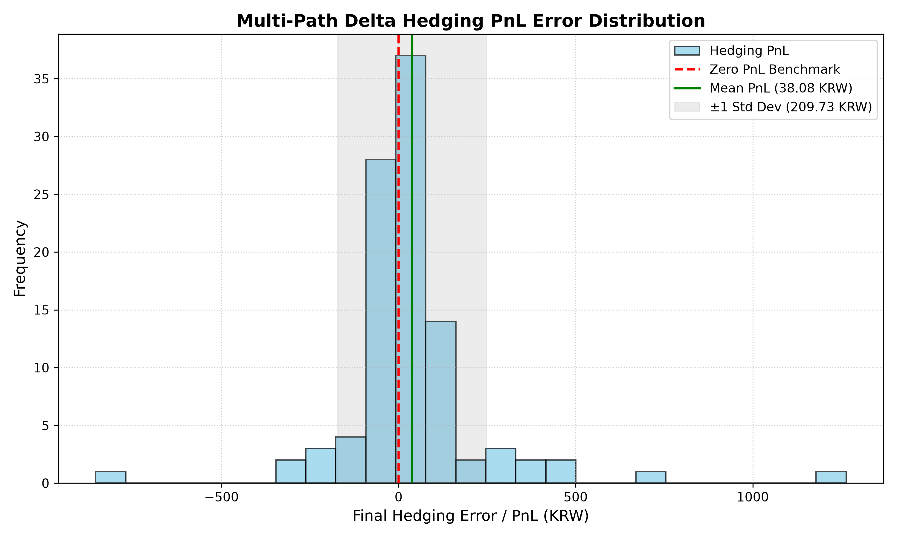

# Financial Mathematics Lab

Quantitative modeling engine for exotic option pricing, numerical Greeks calculation, and multi-path dynamic delta hedging using the **Black-Scholes Model**, **Monte Carlo Simulation**, and the **Finite Difference Method (FDM)**.

---

## Project Overview

This repository implements dynamic derivative pricing and hedging across six core modules:

1. **Analytical Benchmarking:** Closed-form European option pricing via Black-Scholes formulas.
2. **Monte Carlo Pricing Engine:** Path generation for European and path-dependent exotic options (**Up-and-In Barrier Call Option**).
3. **Convergence Analysis:** Accuracy, error rate, and runtime benchmarking across simulation paths ($N = 1,000$ to $200,000$).
4. **Numerical Greeks (FDM):** Path-dependent Delta estimation via Central Finite Difference Method using time-dependent seed offsets ($\text{seed} + t$) to suppress variance.
5. **Dynamic Delta Hedging Simulator:** Daily rebalancing engine tracking continuous compounding cash balances ($e^{r \Delta t}$) across single and multi-path simulations.
6. **Risk & Error Analysis:** Empirical PnL error distribution, mean bias, and standard deviation analysis across simulated trajectories.


---

## Core Logic & Mathematical Flow

### 1. Price Path Generation (Geometric Brownian Motion)
Price paths are generated using discretized Geometric Brownian Motion (GBM):

$$S_{t+\Delta t} = S_t \exp\left( \left(r - \frac{1}{2}\sigma^2\right)\Delta t + \sigma \sqrt{\Delta t} Z \right)$$

### 2. Path-Dependent Up-and-In Call Payoff
* **Knock-In Condition:** Triggered if $\max(S_0, S_1, \dots, S_T) \ge H$
* **Payoff at Maturity:**

$$
\text{Payoff} = \begin{cases}
\max(S_T - K, 0) & \text{if Knocked-In} \\
0 & \text{otherwise}
\end{cases}
$$

### 3. Dynamic Delta Hedging Ledger
* **Day 0:** Sell option for premium $V_0$, purchase $\Delta_0$ shares. Initial cash balance:
  $$\text{Cash}_0 = V_0 - (\Delta_0 \times S_0)$$
* **Day 1 to $T-1$:** Accrue continuous interest on cash balance: $$\text{Cash}_t = \text{Cash} _ {t-1} \cdot e^{r \Delta t}$$

  Rebalance shares: $$\Delta\text{Shares} = \Delta_t - \Delta_{t-1}$$

* **Day $T$:** Liquidate all shares at $S_T$, settle option payoff obligation, and compute **Final Hedging PnL (Hedging Error)**.

---

## Performance & Simulation Results

### 1. Monte Carlo Convergence & Execution Time
* **Benchmark (Black-Scholes European Call):** `1,223.45 KRW`
* **Test Parameters:** $S_0 = 15,500$, $K = 15,000$, $H = 16,000$, $T = 90/365$, $r = 2.5\%$, $\sigma = 30\%$

| Simulations ($N$) | Euro Call (MC) | Error Rate (%) | Up-and-In Call | Execution Time |
| :---: | :---: | :---: | :---: | :---: |
| **1,000** | 1,241.12 KRW | 1.444% | 1,189.50 KRW | 0.0123s |
| **5,000** | 1,218.80 KRW | 0.380% | 1,202.10 KRW | 0.0451s |
| **10,000** | 1,225.10 KRW | 0.135% | 1,217.23 KRW | 0.0890s |
| **50,000** | 1,223.90 KRW | 0.037% | 1,215.40 KRW | 0.4120s |
| **100,000** | 1,223.60 KRW | 0.012% | 1,216.05 KRW | 0.8351s |
| **200,000** | 1,223.48 KRW | 0.002% | 1,216.20 KRW | 1.6820s |

---

### 2. Multi-Path Dynamic Delta Hedging Results (100 Paths)

| Metric | Statistical Result | Financial Interpretation |
| :--- | :---: | :--- |
| **Total Simulation Paths** | `100` | Sample size for path risk evaluation |
| **Knock-In Ratio** | `76.0%` | Proportion of paths triggering barrier ($H = 16,000$) |
| **Mean Hedging Error** | **`38.08 KRW`** | Convergence to near-zero expected loss ($0.2\%$ of $S_0$) |
| **Std Deviation (Risk)** | `209.73 KRW` | Discretization error & gamma risk boundary |
| **Min PnL (Worst Case)** | `-855.03 KRW` | Outlier path with extreme gamma near maturity |
| **Max PnL (Best Case)** | `1,263.34 KRW` | Favorable market trajectory during rebalancing |

---

### 3. Hedging Error (PnL) Distribution



> **Key Takeaway:** The empirical PnL error distribution centers tightly around zero ($\text{Mean} = 38.08\text{ KRW}$), confirming that daily dynamic delta hedging effectively eliminates linear delta risk. The dispersion ($\text{Std} = 209.73\text{ KRW}$) reflects discrete rebalancing noise and short-gamma risks near the barrier.

---

## How to Run

### Requirements
* Python 3.8+
* `numpy`, `matplotlib`

### Run Monte Carlo Convergence Test
```bash
python monte_carlo.py
```

### Run Dynamic Delta Hedging Engine
```bash
python delta_hedging.py
```

### Generate PnL Distribution Chart
```bash
python plot_hedging.py
```
