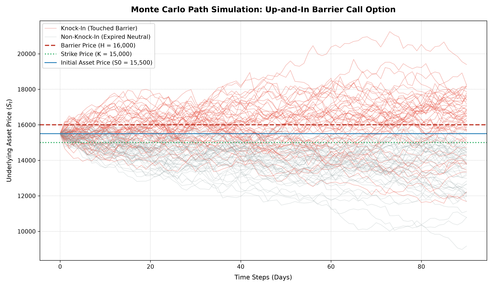

# 📈 Financial Mathematics Lab

> **Python-based Quantitative Finance & Numerical Methods Engine**
>
> 본 저장소는 금융수학(Financial Mathematics) 이론과 수치해석 기법을 바탕으로 유럽형 옵션 가격 결정 모델(Option Pricing Models), 민감도 지표(Greeks), 내재변동성(Implied Volatility), 그리고 몬테카를로(Monte Carlo) 배리어 옵션 시뮬레이션을 Python 객체지향 구조로 구현하고 검증하는 연구 공간입니다.

---

## 1. 주요 구현 모듈 (Key Features)

| 파일명 | 기능 및 핵심 알고리즘 | 설명 |
| :--- | :--- | :--- |
| `black_scholes.py` | European Option Pricing & 5 Greeks Engine | Black-Scholes 공식을 이용한 Call/Put 옵션 가치 산출 및 5대 민감도 지표($\Delta, \Gamma, \nu, \Theta, \rho$) 산출 |
| `implied_volatility.py` | Newton-Raphson Implied Volatility Solver | 옵션의 시장 가격($C_{market}$)으로부터 내재변동성($\sigma$)을 역산하는 수치해석 엔진 |
| `monte_carlo.py` | Monte Carlo Barrier Option & Convergence Engine | 기하 브라운 운동(GBM) 기반 주가 경로 생성, Up-and-In Call 가격 산출 및 수렴도 검증 |
| `visualization.py` | Trajectory Plotting & Visualizer | 배리어 터치 경로(Knock-In)와 미터치 경로 구분 시각화 및 고해상도 이미지 출력 |

---

## 2. 수학적 배경 (Mathematical Background)

### 1) Black-Scholes Model & Greeks (`black_scholes.py`)

유럽형 콜($C$) 및 풋($P$) 옵션의 이론가와 기초 파라미터 관계식은 다음과 같습니다.

$$d_1 = \frac{\ln(S_0 / K) + \left(r + \frac{\sigma^2}{2}\right)T}{\sigma \sqrt{T}}, \quad d_2 = d_1 - \sigma \sqrt{T}$$

$$C = S_0 N(d_1) - K e^{-r T} N(d_2)$$

$$P = K e^{-r T} N(-d_2) - S_0 N(-d_1)$$

---

### 2) Monte Carlo Engine & GBM (`monte_carlo.py`)

기초자산의 가격 변동은 **기하 브라운 운동(Geometric Brownian Motion, GBM)** 확률과정을 따릅니다.

$$dS_t = r S_t dt + \sigma S_t dW_t \implies S_{t+\Delta t} = S_t \exp\left( \left(r - \frac{\sigma^2}{2}\right)\Delta t + \sigma \sqrt{\Delta t} Z \right)$$

* $Z \sim \mathcal{N}(0, 1)$ : 표준정규분포를 따르는 무작위 난수

**Up-and-In Barrier Call Option Payoff:**
옵션 만기($T$) 전까지 기초자산 가격이 배리어($H$) 이상에 도달한 적이 있는 경우에만 페이오프가 발생합니다.

$$\text{Payoff} = \max(S_T - K, 0) \times \mathbb{I}_{\left( \max_{0 \le t \le T} S_t \ge H \right)}$$

---

## 3. 시뮬레이션 및 시각화 결과 (Simulation & Visualization)

### 1) Path Trajectory Visualization (`visualization.py`)

시뮬레이션 조건: $S_0 = 15,500$원, $K = 15,000$원, $H = 16,000$원, $T = 90$일, $r = 2.5\%$, $\sigma = 30\%$



* **Knock-In (Red Lines)**: 기간 중 배리어 $H = 16,000$원에 도달하여 권리가 활성화된 경로
* **Non-Knock-In (Grey Lines)**: 배리어에 도달하지 못해 만기 소멸된 경로

---

### 2) Convergence Benchmark Results (`monte_carlo.py`)

시뮬레이션 횟수($N$)가 증가함에 따라 블랙-숄즈 이론가(**1,229.45원**)로 수렴하는 과정 및 연산 성능 측정 결과입니다.

| Simulations ($N$) | Monte Carlo Price (MC) | 오차율 (Error Rate) | Up-and-In Call Price | 소요시간 (Elapsed Time) |
| :---: | :---: | :---: | :---: | :---: |
| **1,000회** | 1,257.38 원 | 2.271% | 1,247.04 원 | 0.0113초 |
| **5,000회** | 1,232.21 원 | 0.224% | 1,224.46 원 | 0.0421초 |
| **10,000회** | 1,224.83 원 | 0.376% | 1,217.23 원 | 0.1008초 |
| **50,000회** | 1,223.37 원 | 0.495% | 1,214.60 원 | 0.5952초 |
| **100,000회** | 1,222.55 원 | 0.562% | 1,213.94 원 | 1.0282초 |

---

## 4. 시작하기 (Getting Started)

### 필요 라이브러리 설치 (Prerequisites)

```bash
pip install numpy scipy matplotlib
